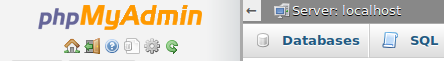

# Box Name <!-- omit in toc -->

# Table of Contents <!-- omit in toc -->
- [Scan Results](#scan-results)
  - [Nmap](#nmap)
    - [Ports](#ports)
  - [Gobuster](#gobuster)
    - [Directories](#directories)
- [Expolit](#expolit)
- [Post Exploit](#post-exploit)
- [Flags](#flags)
    - [User Flag](#user-flag)
    - [Root Flag](#root-flag)

# Scan Results

## Nmap

### Ports
* Port 80 - HTTP
* Port 22 - SSH
  
## Gobuster
install gobuster if you dont have it

```
apt-get install gobuster
```

and run it

```
root@kali:~# gobuster dir -u 10.10.10.37 -w /usr/share/wordlists/dirbuster/directory-list-2.3-medium.txt
===============================================================
Gobuster v3.0.1
by OJ Reeves (@TheColonial) & Christian Mehlmauer (@_FireFart_)
===============================================================
[+] Url:            http://10.10.10.37
[+] Threads:        10
[+] Wordlist:       /usr/share/wordlists/dirbuster/directory-list-2.3-medium.txt
[+] Status codes:   200,204,301,302,307,401,403
[+] User Agent:     gobuster/3.0.1
[+] Timeout:        10s
===============================================================
2020/03/01 15:37:36 Starting gobuster
===============================================================
/wiki (Status: 301)
/wp-content (Status: 301)
/plugins (Status: 301)
/wp-includes (Status: 301)
/javascript (Status: 301)
/wp-admin (Status: 301)
/phpmyadmin (Status: 301)
/server-status (Status: 403)
===============================================================
2020/03/01 16:09:22 Finished
===============================================================
```

### Directories
* /wiki 
* /wp-content 
* /plugins 
* /wp-includes
* /javascript 
* /phpmyadmin

Download files from /plugins folder and extract BlockyCore.jar using

```
jar xf ./BlockyCore.jar
```

Inside the "com" folder find BlockyCore.class file. this is a java class file.
using a java [decompiler](http://www.javadecompilers.com/) we get the following code:

```java
// 
// Decompiled by Procyon v0.5.36
// 

package com.myfirstplugin;

public class BlockyCore
{
    public String sqlHost;
    public String sqlUser;
    public String sqlPass;
    
    public BlockyCore() {
        this.sqlHost = "localhost";
        this.sqlUser = "root";
        this.sqlPass = "8YsqfCTnvxAUeduzjNSXe22";
    }
    
    public void onServerStart() {
    }
    
    public void onServerStop() {
    }
    
    public void onPlayerJoin() {
        this.sendMessage("TODO get username", "Welcome to the BlockyCraft!!!!!!!");
    }
    
    public void sendMessage(final String username, final String message) {
    }
}
```

We get the password for the MySQL database

```
PhpMyAdmin:  
Username: root  
Password: 8YsqfCTnvxAUeduzjNSXe22
```
Go to the phpmyadmin page, and login as root. Click on Databses at the top left  


we can see a wordpress database:  
  

which includes wp_users table. Inside we can see the username and password for the wordpress website

  

```
WordPress:  
username: Notch  
Password: $P$BiVoTj899ItS1EZnMhqeqVbrZI4Oq0/  
Email:    notch@blockcraftfake.com
```

The password is hashed so we cant use it like this. One option is to change it but this leads to nothing interesting. We do see however, that there is a user called Notch,Remember we found that ssh is open on this box? lets try it.  

SSH into the box as _**notch**_ and use the password for the mysql database _**8YsqfCTnvxAUeduzjNSXe22**_.  

We get a shell notch:


Listing the files, we see a _**user.txt**_ file which hold the user flag.

<!--The password field is hashed. In order to change it we edit the entry.
change the user_pass column such that the _Function_ field is _MD5_ and the _Value_ is "password".  

   

Scroll down and press _GO_   
The new password is now "password" and we now we can login into wordpress as Notch-->

# Expolit

# Post Exploit

# Flags

### User Flag
at the root directory of user notch we find the _**user.txt**_  file
which has the flag: _**59fee0977fb60b8a0bc6e41e751f3cd5**_

### Root Flag

